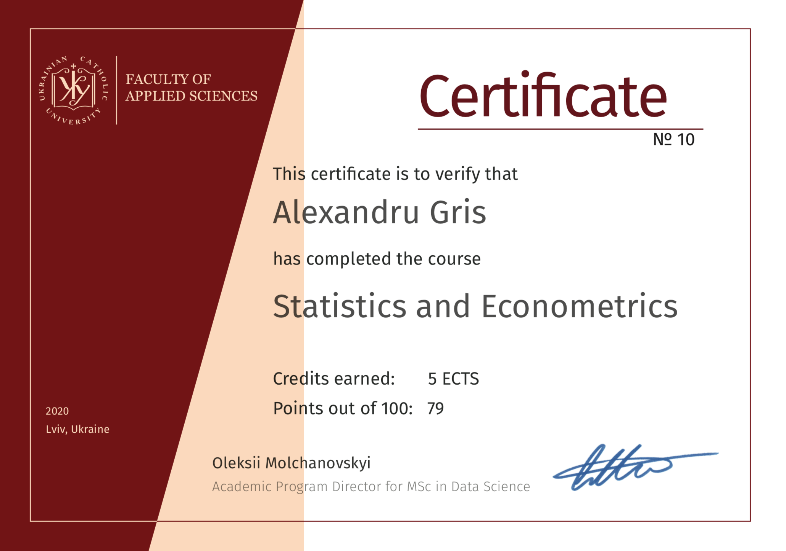

This blog is a complement to [http://blog.alexandrugris.ro](http://blog.alexandrugris.ro) and is dedicated to technology. It started as my private notebook where I jotted down interesting stuff I read on tech, so that I had a reference for later use. Then, I thought, hey, why not make it public? So here it is: “From The Trenches - The Code”.

Who am I?

My name is Alexandru Gris. For a relatively long time worked in the video-games industry, with [Ubisoft Entertainment](https://www.ubisoft.com/en-GB/). 
My career evolved from software developer, lead programmer, producer and production director. I love technology, I love building stuff while working with smart, creative people.  I have a strong interest in software architecture, clean code, leadership, organization design, entrepreneurial thinking and high quality project management.

I currently work as CTO in the sports betting industry. I have recently acquired a new interest: statistics and machine learning, thus some of the posts on this blog are related to that. 

}